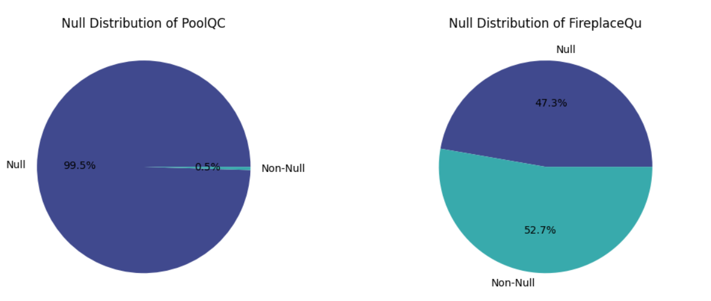
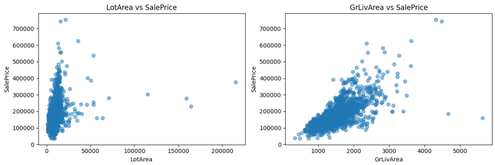
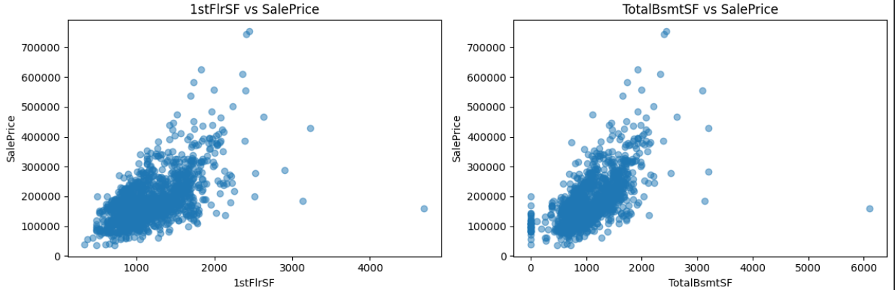
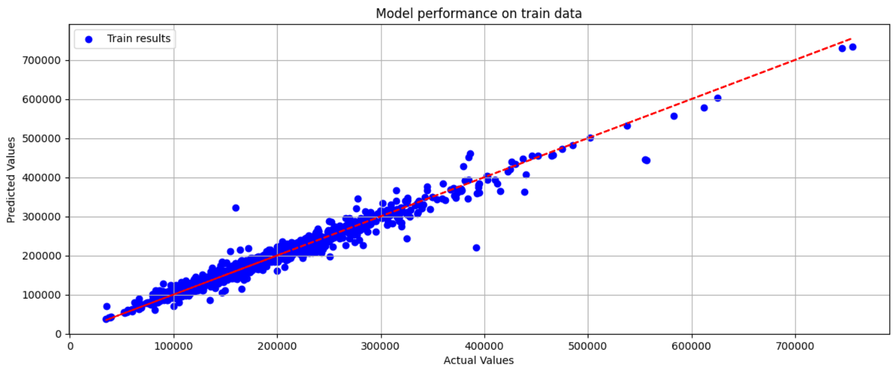
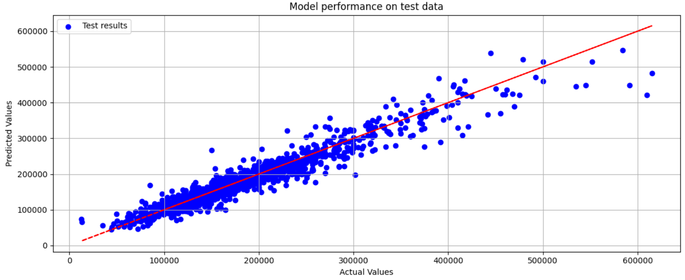

# 🏡 Housing Price Prediction

## 📌 Project Overview  
Real estate valuation is critical for property transactions, investments, and market analysis. Predicting housing prices accurately helps buyers, sellers, and real estate professionals make informed decisions. This project builds a **machine learning model** to predict housing prices based on various attributes of residential properties.

## 🎯 Objective  
The goal is to develop a reliable **machine learning model** that predicts housing prices based on property characteristics. This will assist **buyers, sellers, and real estate professionals** in making data-driven decisions regarding property valuation.

---

## 📂 Dataset Description  
The dataset includes a variety of features influencing housing prices:

| Feature        | Description |
|---------------|-------------|
| **MSSubClass** | Building class of the property |
| **MSZoning**   | General zoning classification |
| **LotFrontage** | Linear feet of street connected to the property |
| **LotArea**    | Lot size in square feet |
| **Street**     | Type of road access |
| **Alley**      | Type of alley access |
| **LotShape**   | General shape of the property |
| **SalePrice**  | Target variable - the property's sale price |

👉 *For the full dataset description, check the [Kaggle dataset](https://www.kaggle.com/code/ayushgharat17/housing-price-prediction-code-presentation).*

---

## 🔍 Exploratory Data Analysis (EDA)  
### 1️⃣ Handling Missing Values  
- Columns with a **high percentage of missing values** (e.g., `PoolQC`, `Alley`) were **removed** to avoid bias.
  
- Numerical features (e.g., `LotFrontage`) were **imputed** using the median.
- Categorical features were **filled** with mode or `"None"` for missing categories.

### 2️⃣ Feature Engineering  
- Created new features such as **Total Bathrooms (Bath)** combining full and half baths.
- Calculated **house age** (`AgeYrSold`, `AgeGarageYrBlt`) to add time-based insights.
- Combined **Total Floor Area** (`TotalFlrSF`) and **Basement Area** (`BsmtFinSF`) for better representation.

### 3️⃣ Skewness & Outliers Handling  
- **Log transformations** were applied to skewed features to normalize the data.
- **Outliers** were detected using scatterplots and removed to improve model generalization.
 

---

## 🏗 Model Building & Evaluation  
A **machine learning pipeline** was implemented to streamline preprocessing and model selection.

### 🚀 Models Used:
1. **Linear Regression**
2. **Ridge Regression**
3. **Lasso Regression**
4. **ElasticNet Regression**
5. **Random Forest Regressor**
6. **XGBoost Regressor**
7. **Gradient Boosting Regressor**
8. **Support Vector Regressor (SVR)**

### 📊 Performance Metrics:
| Model                     | RMSE  |
|---------------------------|------|
| **Linear Regression**     | 0.176 |
| **Ridge Regression**      | 0.157 |
| **Lasso Regression**      | 0.203 |
| **ElasticNet Regression** | 0.159 |
| **Random Forest**         | 0.138 |
| **XGBoost**               | 0.135 |
| **Gradient Boosting**     | 0.133 |
| **SVR**                   | 0.167 |

🔹 *Gradient Boosting and XGBoost had the lowest RMSE, making them the best performers.*




---

## 🚀 Deployment & Business Impact  
- **Investment Analysis:** Helps real estate investors evaluate properties.
- **Price Estimation:** Assists homebuyers in understanding fair pricing.
- **Market Trends:** Provides insights for developers and analysts.

---

## 🛠 Installation & Usage  
### 1️⃣ Clone the Repository:
```bash
git clone https://github.com/your-username/housing-price-prediction.git
cd housing-price-prediction
```

### 2️⃣ Install Dependencies:
```bash
pip install -r requirements.txt
```

## 📩 Contact & Collaboration
Interested in contributing or using this model for business applications? Reach out! 🚀

**📧 Email**: ayushgharat234@gmail.com
**🔗 LinkedIn**: https://www.linkedin.com/in/ayush-gharat-3500a51a9/